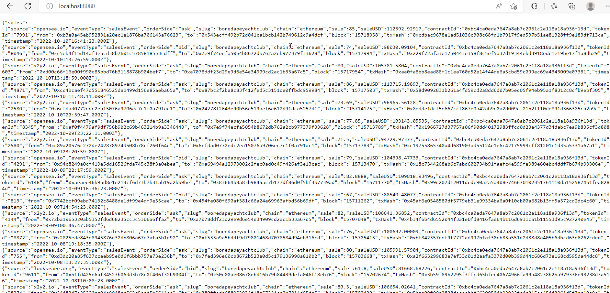
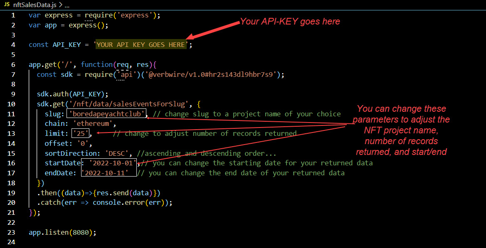

    

# fastMint
This simple minting app was built using the Verbwire API. The app lets you mint an NFT from a simple image file, or metadata file. You can mint on any of the 14 supported blockchains (7 testnets and 7 mainnets). For more details on using the Verbwire API you can access the full API docs [here](https://docs.verbwire.com/docs)

## Requirements
1. You'll need a Verbwire API Key. You can sign up for a free API key [HERE](https://www.verbwire.com/auth/register)

## Steps to run program locally
1. In the file, fastMint.js, replace the text "YOUR API KEY GOES HERE" with your actual API key. See image in the additional section below.

2. From you command prompt, type in *npm i* to install node modules

3. From you command prompt, type in *node fastMint.js* to start the program 

4. Open your browser and goto localhost:8080/url to mint directly from a metadata file, or localhost:8080/image to mint directly from an image file

5. See notes below on minting 

Your screens should look like this

## Minting Notes:
### Minting from a metadata file
1. To see the program working you can test with this sample metadatafile: https://ipfs.io/ipfs/bafyreia3gktjytjez7vgj4wnshdthsagh4lz2tgib4in2xiirbibziga6e/metadata.json

2. You can create your own metadatafile very easily by using the Verbwire endpoint, *Upload local file as metadata to IPFS*, [HERE](https://docs.verbwire.com/reference/post_nft-store-metadatafromimage), right on the verbwire website. Simply upload your file and you'll get a metadata .json link returned.

    

### Minting from a metadata file

## Additional Info
### 1. Showing where to input your API Key, as well as changing parameters

    

